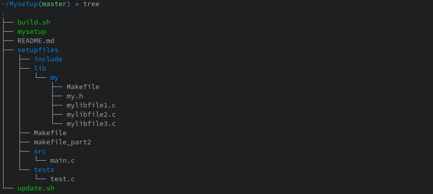

# Mysetup Function
A program to help you create a new project directory

---
# Installation
Type the following lines in a terminal :
`>cd
>git clone https://github.com/Curs3W4ll/Mysetup.git
>cd Mysetup
>chmod 755 build.sh
>./build.sh`
You should have :
`>>>Installation done
>>>Type mysetup to use it`

If you have trouble to install the program please contact the developer

---
# Configuration
Before use the mysetup program, you need to configure it a litle
First of all, please never modify or move another file than the following ones :
-lib/my/Makefile
-tests/\*

So, to correctly config your setup, please copy your library to this path : setupfiles/lib
Actually, this folder is empty but you need to feel it with your personal library

---
# Usage
Use `mysetup` for help

Please do configuration step before start using the program
Mysetup allow you to create your new project directory easily
After doing your setup, you will have a new directory with the name you want looking with that look :

To use the mysetup program, you need to type the following line :
`my_setup my_project_name my_binary_name`
If you want to make your directory from a git, then you can add a third argument like :
`my_setup my_project_name my_binary_name git_url`

---
# Other usefull program :
[Analyse program](https://github.com/benalex33000/AnalyseFunction)
